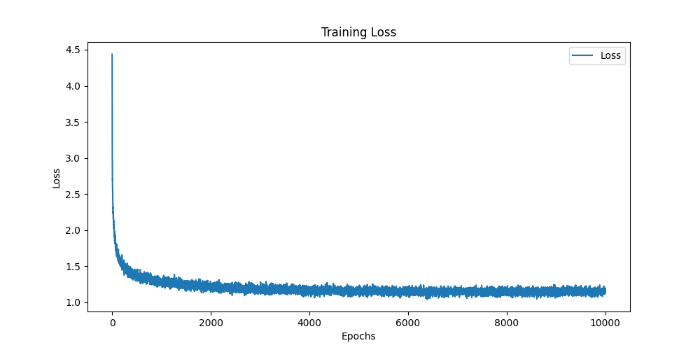

# character-level-language-modeling

## Introduction

This project is a character-level language model that is trained on a dataset of Shakespeare's works. The model is trained using a recurrent neural network (RNN) with long short-term memory (LSTM) cells. The model is trained to predict the next character in a sequence of characters.

## Data

The dataset used for training the model is a collection of Shakespeare's works. The dataset is available in the `data` directory. The dataset is preprocessed to remove any non-ascii characters and to convert all characters to lowercase.

## Results

The model is trained for 10000 epochs with a batch size of 64, and the following results are obtained:

